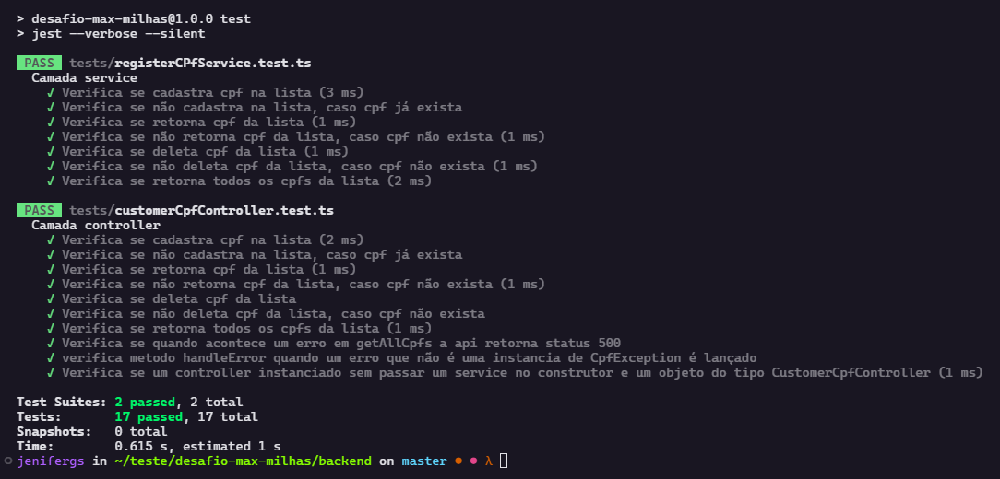
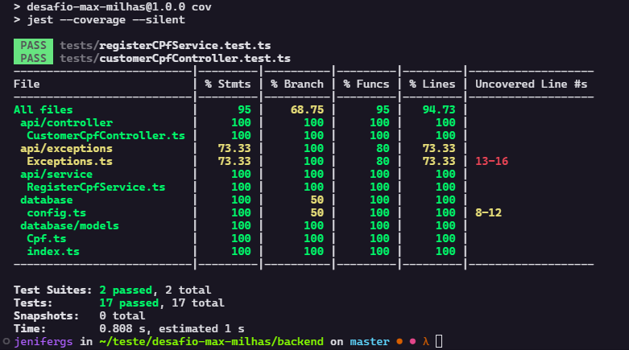
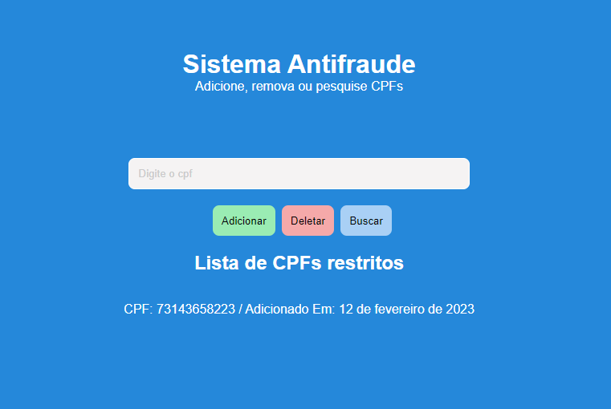

# Seja bem vindo ao desafio Técnico MaxMilhas ✈️

## Sobre o projeto
O objetivo deste projeto era desenvolver uma API que expusesse Rotas através das quais fosse possível realizar as operações CRIAÇÃO, REMOÇÃO e LEITURA de CPF's em uma lista restrita.
## Arquitetura
### Banco de dados
O banco de dados conta com uma unica entidade chamada **CPF**:
| Nome Da Coluna | Tipo Da Coluna | Descrição                                                                                         |
|----------------|----------------|---------------------------------------------------------------------------------------------------|
| cpf            | INTEGER        | Essa é a chave primaria e também é a coluna que armazena o valor do cpf adicionado na lista negra |
| created_at     | DATE           | Esse valor deverá ser uma data formatada no padrão ISO-8601 |


### API
A API segue uma arquitetura Model-Service-Controller. Essa Arquitetura foi escolhida dado que a complexidade
da regra de negócio era baixa o que motivou a escolha de uma arquitetura mais simples e concisa.

Basea-se na divisão entre 3 camadas principais:
- O **Controller** responsável por lidar com todo fluxo de entrada e saída dos programas através das rotas expostas na APi e delegar o processamento das informações para o service.
- O **Service** responsável por tratar e processar a regra de negócio além de conectar com o Model.
- O **Model** responsável por conectar a regra de negócio ao banco de dados.

## Infraestrutura
### Banco de dados
O banco de dados é o mysql na versão 8, rodado em um container Docker.
### API
A api foi desenvolvida com:
| Nome da Dependência   | Versão da Dependência         | Descrição |
|---------------------  |-----------------------        |------------------------------------------------------------------------------------------------------------------------       |
| NodeJs                | 18.14.0                       | Esse foi o runtime escolhido para rodar o projeto desenvolvido                                                                |
| Typescript            | 4.9.5                         | O superset do Javascript foi utilizado nesse projeto para possibilitar a tipagem estatica facilitando conceitos da POO        |
| Express               | 4.18.2                        | O express é a biblioteca utilizada para subir o servidor HTTP e expor as rotas REST                                           |
| Sequilize             | 6.28.0                        | O sequilize foi definido para ser a ORM que possibilita a conexão com o banco de dados MySQL                                  |
| Mysql2                | 3.1.2                         | Utilizado em conjunto com o Sequilize para fornecer a conexão com o banco de dados                                            |
| Cpf-Cnpj-Validator    | 1.0.3                         | Utilizado para simplificar a validação do CPF do usuario a ser adicionado na blacklist                                        |
| Dotenv                | 16.0.3                        | Instalado para realizar a função de ler os arquivos de ambiente e adiciona-los a variável process.env                         |
| Jest                  | 29.4.2                        | Framework instalado com finalidade de implementar os testes                                                                   |
| Eslint                | 8.33.0                        | Biblioteca utilizada realização de análise estática do código para detecção de problemas.                                     |


### Estrutura de Pastas e Arquivos
- src
  - api:
    - controller: representa a pasta que contém os arquivos responsáveis por representar a camada controller já descrita nesse documento
    - exceptions: contém as exceções que serão lançadas em situações previstas pela regra de negócio
    - interfaces: contém interface que representa o dado que será trafegado através da api
    - middlewares: contém arquivos com funções que serão executadas antes das funções do controller, útil nesse contexto para validar o formato do cpf
    - routes: contém a arquivo que configura as rotas
    - services: contem arquivos que processarão a regra de negócio
    - index.ts: arquivo principal que inicia o servidor.
    - database: contém arquivos de configuração do sequilize e modelos para conectar backend typescript com o banco de dados
    - migration: contém arquivos de migração usado pelo sequilize
    - models: contém modelo de conexão entre sequilize e codigo typescript
    - config.js: arquivo contém configuração para se conectar com o banco


## Executando o projeto
> Aviso: Para executar esse projeto é obrigatório que se tenha instalado e acessível o Docker.

### Passo 1:
Na pasta raiz (pasta que está no mesmo nível que README.md e docker-compose.yml)

Execute o docker compose para subir os containers
```
docker-compose up
```

E importante nesse passo esperar que o container do backend esteja completamente 'de pé' e essa operação demora alguns minutos, entretanto, você verá a mensagem "Server started on port 3333!" Quando a api estiver pronta para receber as requisições.

### Passo 2:
Para testar as rotas você deve acessar
```
http://localhost:3333/cpf
```

- A US1 é mapeado para um endpoint **POST**  passando como corpo da requisição um payload json
{ "cpf": "valor_do_cpf" }
- A US2 é mapeada para um endpoint **GET** cpf/:cpf  sendo assim será necessario executar um GET similar a:
http://localhost:3333/cpf/numero_do_cpf
- A US3 é mapeada para um endpoint **DELETE** cpf/:cpf, sendo será necessario executar um DELETE para um endereço similar a: http://localhost:3333/cpf/numero_do_cpf
- A US4 é mapeada para o endpoint **GET** cpf/ sem o cpf na frente, sendo assim executar um GET para o endereço: http://localhost:3333/cpf/

> Caso  você use Insomnia para executar as requisições poderá importar com o botão abaixo

[](https://insomnia.rest/run/?label=desafio-maxmilhas&uri=https%3A%2F%2Fraw.githubusercontent.com%2Fjenifergs%2Fdesafio-max-milhas%2Fmaster%2Fassets%2Finsomnia-maxmilhas)

### Passo 3:
Para executar os testes unitários, você precisará acessar o container, para isso, execute um:
```
docker exec -it backend sh
```
Agora, dentro do container execute um:
```
npm run test
```
Algo como:    
  

<!--  -->
Também é possivel ver a covertura de codigo, execute um:
```
npm run cov
```
Algo parecido com:    
  

<!--  -->

## Acessando o frontend
Nos passos anteriores foi instruido que se colocasse pare rodar os containers atraves do docker, sendo assim a aplicação React deverá estar disponivel na porta 3000, sendo assim acesse
> http://localhost:3000/ 

Obs: Para listar todos os cpfs adicionados na lista de restrição, basta clicar no botão buscar sem adicionar valor ao input.

Você deverá encontrar uma interface como:   

  

<!--  -->

Feito com 💙 Por Jenifer Gonçalves Com:
 <div style="display: inline_block" align="left"><br>
  
  
  
  
  
  
  
  
  
 
 
 
 
 
             
</div>
